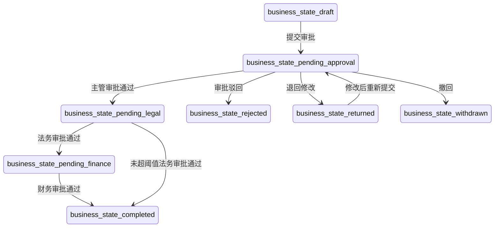

# pm-html-pdt-fused 技能使用手册

> 以「合同审批管理」项目为例，完整演示如何在 Trae IDE 中使用该技能从零到一完成 B 端产品交付。

---

## 目录

1. [技能概述](#1-技能概述)
2. [环境准备与安装](#2-环境准备与安装)
3. [核心概念](#3-核心概念)
4. [完整工作流实战：合同审批管理](#4-完整工作流实战合同审批管理)
   - 4.1 第一步：输入需求（支持文字 + 原始资料）
   - 4.2 第二步：自动初始化（技能自动完成）
   - 4.3 第三步：原始资料处理（如有）
   - 4.4 第四步：对话澄清（如有）
   - 4.5 第五步：需求整理与功能清单
   - 4.6 第六步：生成业务原型
   - 4.7 第七步：复杂度评估
   - 4.8 第八步：生成 PRD
   - 4.9 第九步：PRD 标注原型
   - 4.10 第十步：一致性检查
   - 4.11 第十一步：业务确认单与上线交付包
5. [多角色审查系统](#5-多角色审查系统)
6. [产物清单与说明](#6-产物清单与说明)
7. [入口模式详解](#7-入口模式详解)
   - 7.1 变更模式
   - 7.2 配置变更模式
   - 7.3 Bug 修复模式
   - 7.4 数据迁移模式
   - 7.5 系统对接模式
   - 7.6 需求接入与跳步模式
8. [进阶用法](#8-进阶用法)
   - 8.1 修改与迭代（自然语言编辑）
   - 8.2 使用 CLI 批量操作
   - 8.3 生成模式与 LLM 配置
   - 8.4 本地 Web UI
9. [常见问题与排错](#9-常见问题与排错)
10. [附录：产物文件结构](#10-附录产物文件结构)

---

## 1. 技能概述

`pm-html-pdt-fused` 是一个面向 B 端产品经理的 AI 闭环技能，能够将一段自然语言需求自动转化为：

| 主交付物 | 说明 |
|---|---|
| **产品原型** | 可直接在浏览器打开的高保真 HTML 原型，包含完整页面、交互状态和角色差异 |
| **PRD** | 覆盖页面、模块、字段、动作、权限、状态机、异常和边界的结构化需求文档 |
| **PRD 标注原型** | 在原型上挂载标注编号，可反查 PRD 章节、测试用例和权限规则 |

| 支撑产物 | 说明 |
|---|---|
| `project-state.json` | 结构化单一事实源，所有产物从此渲染 |
| `prototype-spec.json` | 页面、模块、字段、动作、权限和 mock 数据 |
| `prototype-meta.json` | DOM 与实体映射关系 |
| `prototype-annotations.json` | 标注与 PRD / 测试 / 权限的映射 |
| `test-cases.md` | 手工测试用例 |
| `gherkin.feature` | BDD 验收场景 |
| `flow.mermaid` | 状态流转图 |
| `consistency-report.md` | 闭环质量检查报告 |

**核心工作流**：需求输入 → 自动初始化 → 原始资料处理（如有）→ 对话澄清（如有）→ 功能清单 → 原型 → 复杂度评估 → PRD → 标注 → 一致性检查 → 业务确认单 + 上线交付包

**关键特性**：
- 对话驱动，一次只推进一个节点，每步都等你确认
- 状态机默认必做；审批流只在需求出现审批语义时自动启用
- 所有产物可追溯：原型实体 ID → PRD 章节 → 测试用例 → 标注编号
- 支持多角色 AI 审查：6 个专家角色在生成前提供结构化反馈
- 6 种入口模式：新建、变更、配置变更、Bug修复、数据迁移、系统对接，自动识别并走对应流程
- 增量修改与回退：修改上游产物时自动识别受影响的下游产物并重新生成
- B 端专业建模：主数据管理、6 级数据权限、批量操作、操作日志、编码规则、报表统计、导入导出
- 11 种页面模式 + 12 种交互模式 + 10 类异常场景标准库

---

## 2. 环境准备与安装

### 2.1 安装技能到 Trae IDE

技能已通过符号链接安装为全局技能：

```
~/.trae/skills/pm-html-pdt-fused → /路径/pm-html-pdt-fused/
```

在任意项目中打开 Trae IDE，该技能都会自动可用。

### 2.2 验证安装

在 Trae IDE 的 **Settings → Rules & Skills → Global** 中，应能看到 `pm-html-pdt-fused` 技能。

### 2.3 CLI 环境（可选，用于本地调试）

```bash
# 进入技能目录
cd "/路径/pm-html-pdt-fused"

# 安装依赖
pnpm install

# 验证环境
pnpm typecheck
pnpm test
```

### 2.4 项目目录（自动创建）

**你不需要手动准备目录。** 技能会在首次收到需求时自动完成以下操作：

1. 从需求内容推断项目目录名（英文短横线命名，如 `contract-approval`）
2. 在当前工作目录下创建项目目录、`output/` 子目录和 `raw-materials/` 子目录
3. 将你的原始需求写入 `input.md`
4. 生成空的 `project-state.json`
5. 如果你提供了参考资料（截图、文档、表格等），保存到 `raw-materials/` 目录

自动生成的目录结构如下：

```
contract-approval/           # 技能自动创建，名称从需求推断
├── input.md                 # 技能自动写入你的原始需求
├── project-state.json       # 技能自动生成空状态
├── raw-materials/           # 原始资料目录（可选）
│   ├── chat-screenshot.png  # 聊天记录截图
│   ├── policy.docx          # 管理制度文档
│   └── data-table.xlsx      # 数据表格
└── output/                  # 技能自动创建，后续产物存放于此
    ├── index.html           # 高保真 HTML 原型
    ├── prd.md               # 结构化 PRD
    ├── prototype-review.html # 带标注的原型
    ├── prototype-spec.json  # 页面/模块/字段规格
    ├── prototype-meta.json  # DOM 与实体映射
    ├── prototype-annotations.json # 标注映射
    ├── test-cases.md        # 测试用例
    ├── gherkin.feature      # BDD 验收场景
    ├── flow.mermaid         # 状态流转图
    ├── consistency-report.md # 一致性检查报告
    ├── 业务确认单.md          # 面向业务方的确认单（非技术语言）
    └── 上线交付包.md          # 权限/字典配置清单 + Checklist + 培训大纲
```

> **注意**：如果推断的目录已存在，技能会直接复用，不会覆盖已有文件。`raw-materials/` 目录在没有参考资料时会创建为空目录。

---

## 3. 核心概念

### 3.1 ProjectState（项目状态）

`project-state.json` 是整个技能的**单一事实源**。所有产物（原型、PRD、标注、测试用例）都从这个状态文件渲染生成。修改需求时，技能会先更新 ProjectState，再重新渲染受影响的产物。

核心实体类型：`goal`、`role`、`business_object`、`scenario`、`feature`、`acceptance_criterion`、`page`、`module`、`field`、`action`、`permission`、`ui_state`、`business_state`、`state_transition`、`flow`、`prd_section`、`test_case`、`prototype_annotation`。

### 3.2 状态机

每个 B 端需求都会自动生成状态机，至少包含：
- 初始态（如 `draft`）
- 中间态（如 `pending_approval`、`pending_finance`）
- 终态（如 `completed`、`rejected`）
- 触发动作和允许角色
- 非法流转拦截规则

### 3.3 审批流

技能会自动检测需求中的审批语义关键词：
- 审批、审核、复核、提交审批
- 通过、驳回、撤回、转审
- 审批记录、审批节点、审批意见

一旦检测到，自动启用审批流，补齐审批节点、角色、动作、驳回原因、撤回规则等。

### 3.4 实体追溯

原型中的关键元素会携带稳定的 `data-*` 属性：

```html
<section data-page-id="page_contract_detail" data-module-id="module_approval_actions">
  <button data-action-id="action_approve">通过</button>
</section>
```

这些 ID 会贯穿 PRD、标注、测试用例和一致性检查，确保所有产物可追溯。

### 3.5 原始资料

技能支持在需求输入时提供参考资料，作为需求文本的补充。支持的文件类型：

| 文件类型 | 扩展名 | 提取方式 |
|---|---|---|
| 图片 | `.png`/`.jpg`/`.jpeg`/`.gif`/`.webp` | AI 视觉识别，提取文字、流程图、表格 |
| Word 文档 | `.docx`/`.doc` | 读取全文，提取业务规则、流程描述 |
| Excel 表格 | `.xlsx`/`.xls` | 读取数据，提取枚举值、配置项、阈值 |
| PDF 文档 | `.pdf` | 读取内容，提取制度条款、规范说明 |
| Markdown / 纯文本 | `.md`/`.txt` | 直接读取，提取结构化信息 |

原始资料保存在 `raw-materials/` 目录中，技能会逐份读取并提取关键信息，整理成结构化摘要后向你确认，再进入功能清单。

### 3.6 复杂度评估（S/M/L）

技能会自动评估需求复杂度，分为三个级别：

| 级别 | PRD 章节数 | 适用场景 |
|------|-----------|---------|
| **S 级** | 8 章节 | 单页面、少角色、简单流程 |
| **M 级** | 17 章节 | 多页面、多角色、有审批流 |
| **L 级** | 21 章节 | 复杂业务、多状态机、大量权限规则 |

AI 会自动评估并建议级别，你确认后使用对应模板生成 PRD。

### 3.7 对话推进模式

技能采用**单节点推进**策略：

```
需求输入 ──自动──▶ 初始化目录 ──自动──▶ 原始资料处理（如有）──确认──▶ 对话澄清（如有）──确认──▶ 功能清单 ──确认──▶ 原型 ──确认──▶ 复杂度评估 ──确认──▶ PRD ──确认──▶ 标注 ──确认──▶ 一致性检查 ──确认──▶ 业务确认单 + 上线交付包
```

收到需求后，技能会先自动创建项目目录（无需你操作）。如果有原始资料，会先处理资料并等你确认；如果没有原始资料，直接进入功能清单。后续每个节点完成后会暂停，等待你确认后再进入下一步。你可以随时要求修改当前节点，技能会优先修复当前节点而不是越级生成后续产物。

### 3.8 入口模式（6 种）

除了默认的"从零新建"全流程，技能会自动识别以下入口模式：

| 入口模式 | 触发条件 | 走什么流程 |
|----------|----------|-----------|
| **新建模式**（默认） | 首次需求输入 | 完整 9+1 步闭环 |
| **变更模式** | 提到已有功能 + 变更语义（修改/调整/去掉） | 读取已有项目状态 → 识别变更点 → 评估影响 → 生成 diff → 执行变更 |
| **配置变更模式** | 枚举/阈值/权限变更语义 | 精简 4 步：识别类型 → 定位影响 → 生成配置清单 → 回归测试点 |
| **Bug 修复模式** | XX不对/XX没生效/XX报错 | 生成 Bug 需求卡 → 评估影响 → 回归测试点 |
| **数据迁移模式** | 迁移/导入/历史数据 | 字段映射 → 清洗规则 → 验证方案 → 回滚方案 |
| **系统对接模式** | 对接/同步/推送/XX系统 | 接口清单 → 字段映射 → 异常处理 → 对接方案 |
| **需求接入模式** | 已有 PRD/原型，只做部分流程 | 导入已有产物 → 前置条件检查 → 执行指定节点 |
| **跳步模式** | 只需要做一致性检查/只生成测试用例等 | 前置条件检查 → 执行目标节点 |

### 3.9 增量修改与回退

修改上游产物时，技能会自动识别受影响的下游产物：

| 修改对象 | 受影响产物 |
|----------|-----------|
| 功能清单 | 原型 → PRD → 标注 → 一致性检查（全部回退） |
| 原型 | PRD → 标注 → 一致性检查 |
| PRD | 标注 → 一致性检查 |
| 标注 | 一致性检查 |

技能会展示影响范围，等你确认后自动重新生成受影响的产物。

### 3.10 B 端业务建模能力

技能内置以下 B 端专业建模能力，会在需求澄清阶段自动识别并追问：

| 建模能力 | 触发条件 | 说明 |
|----------|----------|------|
| **主数据管理** | 涉及客户/供应商/产品/员工等基础实体 | 自动追问数据来源、维护角色、引用关系、生命周期 |
| **数据权限**（6 级） | 涉及不同角色看不同数据范围 | 支持 self/department/department_children/project/region/all |
| **批量操作** | 涉及列表页 | 自动追问支持的批量操作、数量限制、部分失败处理 |
| **操作日志** | B 端需求默认包含 | 详情页自动生成操作记录模块 |
| **编码规则** | 涉及单据编号 | 自动追问编号格式、生成时机、是否可修改 |
| **报表统计** | 涉及统计/看板/报表 | 自动追问统计维度、指标、数据口径、更新频率 |
| **导入导出** | 涉及数据导入/导出 | 自动追问格式、范围、数量限制、错误处理 |

---

## 4. 完整工作流实战：合同审批管理

### 4.1 第一步：输入需求（支持文字 + 原始资料）

在 Trae IDE 的对话框中，直接用自然语言描述你的需求。**也可以同时提供参考资料**（截图、Word、Excel、PDF 等），技能会自动处理。

**方式一：纯文字输入**

```
我要做一个合同审批管理功能，给销售、销售主管、法务、财务和管理员使用。
销售创建合同后提交审批，主管审批通过后到法务，法务审批通过后合同生效。
金额超过 50 万元的合同需要增加财务审批节点。
驳回后合同终止，销售可以复制为新合同重新提交。
退回后销售可以修改后重新提交。
```

**方式二：文字 + 原始资料**

在对话框中拖入或粘贴参考资料，然后输入：

```
我要做一个合同审批管理功能，参考资料已经放在附件里了。
其中聊天记录里讨论了审批流程，Word 文档是现有的合同管理制度，Excel 是客户和合同模板清单。
```

**技能会自动识别**：
- 这是一个 B 端产品需求
- 包含审批语义 → 自动启用审批流
- 涉及多角色权限差异
- 有金额阈值条件分支
- 检测到原始资料 → 自动保存并进入资料处理

---

### 4.2 第二步：自动初始化（技能自动完成，无需你操作）

收到需求后，技能会**自动**完成项目目录初始化，你不需要做任何事。

**技能自动执行的操作**：
1. 从需求推断项目目录名 → `contract-approval`
2. 创建 `contract-approval/`、`contract-approval/output/` 和 `contract-approval/raw-materials/` 目录
3. 将你的原始需求写入 `contract-approval/input.md`
4. 生成空的 `contract-approval/project-state.json`
5. 如果你提供了参考资料，保存到 `contract-approval/raw-materials/`

**技能输出示例（无原始资料）**：

```markdown
当前节点：自动初始化
产物：
- contract-approval/input.md（已写入需求原文）
- contract-approval/project-state.json（空状态）
- contract-approval/raw-materials/（原始资料目录，当前为空）
- contract-approval/output/（输出目录）

已自动创建项目工作目录，正在进入功能清单整理...
```

**技能输出示例（有原始资料）**：

```markdown
当前节点：自动初始化
产物：
- contract-approval/input.md（已写入需求原文）
- contract-approval/project-state.json（空状态）
- contract-approval/raw-materials/（已保存 3 份原始资料）
- contract-approval/output/（输出目录）

已自动创建项目工作目录，检测到原始资料，正在进入资料处理...
```

> 初始化完成后，如果没有原始资料，技能会直接进入功能清单；如果有原始资料，会进入原始资料处理节点。

---

### 4.3 第三步：原始资料处理（如有原始资料）

如果你提供了参考资料，技能会逐份读取并提取关键业务信息。

**技能输出示例**：

```markdown
当前节点：原始资料处理
已读取 3 份原始资料：

1. 聊天记录截图（chat-screenshot.png）
   - 提取到：合同审批流程为「销售提交 → 主管审批 → 法务审批 → 财务审批」
   - 提取到：金额超过 50 万元需要财务审批
   - 提取到：当前用邮件流转，经常丢失审批记录

2. 合同管理制度（contract-policy.docx）
   - 提取到：合同分为「标准合同」和「框架协议」两类
   - 提取到：框架协议需要法务和财务双重审批
   - 提取到：合同附件必须包含客户资质和报价单

3. 客户名单（customer-list.xlsx）
   - 提取到：共有 156 个客户，分为 A/B/C 三个等级
   - 提取到：A 级客户合同可走快速审批通道

基于原始资料，我整理了以下信息，需要你确认：
1. 合同类型：标准合同 + 框架协议
2. 审批路径：销售 → 主管 → 法务 → 财务（超 50 万）/ 销售 → 主管 → 法务（未超 50 万）
3. 客户管理：A/B/C 三级，A 级可走快速通道

还有几个问题需要澄清：
1. 框架协议是否也需要金额阈值判断？
2. 快速审批通道具体跳过哪些节点？
3. 客户等级由谁维护？

请确认以上信息是否准确，并回答待澄清问题。
```

**你的操作**：
- 确认信息准确 → 回复「确认」并回答澄清问题
- 有修正 → 直接指出，如「框架协议不走金额阈值，统一走三级审批」

---

### 4.4 第四步：对话澄清（如有需要）

原始资料处理完成后（或没有原始资料时），如果存在信息缺失或矛盾，技能会主动补问。

**澄清原则**：
- 最多补问 1 轮，每轮不超过 5 个问题
- 问题具体，给出选项或默认值建议
- 能推断的不问，不阻塞的留到后续节点

**技能输出示例**：

```markdown
当前节点：对话澄清
基于原始资料和需求文本，还有以下信息需要确认：

1. 框架协议是否也需要金额阈值判断？（建议：不需要，统一走三级审批）
2. 快速审批通道具体跳过哪些节点？（建议：跳过主管审批，直接到法务）
3. 客户等级由谁维护？（建议：销售部，可在管理后台配置）

请确认或修改，确认后进入功能清单整理。
```

**你的操作**：
- 确认建议 → 回复「确认」
- 修改 → 直接指出，如「快速通道不跳过主管，只是法务和财务并行审批」

> 确认后，技能立即进入功能清单节点。

---

### 4.5 第五步：需求整理与功能清单

技能自动进行结构化整理，生成功能清单。

**技能输出示例**：

```markdown
当前节点：功能清单
产物：contract-approval/output/功能清单.md

摘要：
- 识别出 5 个角色：销售、销售主管、法务、财务、管理员
- 识别出核心业务对象：合同（Contract）
- 识别出 6 个状态：草稿、待主管审批、待法务审批、待财务审批、已生效、已驳回、已退回、已撤回
- 识别出金额阈值分支：50 万元
- 审批流已启用：3 条审批路径（超阈值/未超阈值/驳回后复制）
- 识别出 2 个核心页面：合同列表页、合同详情页

待确认：
1. 退回修改后重新提交，是否需要重新走完整审批流？（已按需求默认：是）
2. 被驳回的合同复制为新合同时，是否保留原合同的附件？（待确认）

请确认是否继续生成原型；如需修改，请直接指出模块或规则。
```

**你的操作**：
- 确认无误 → 回复「确认，继续」或「没问题，生成原型」
- 需要修改 → 直接指出，如「退回修改后不需要重新走完整审批流，只需要当前节点重新审批」

---

### 4.6 第六步：生成业务原型

确认功能清单后，技能开始生成高保真 HTML 原型。

**技能输出示例**：

```markdown
当前节点：原型
产物：contract-approval/output/index.html

摘要：
已生成合同审批管理原型，包含以下页面：

1. 合同列表页
   - 筛选区：合同编号、客户名称、合同状态、金额范围、创建人、提交时间、审批节点
   - 列表表格：合同编号、客户名称、合同金额、状态、创建人、当前审批节点、操作
   - 角色差异：销售看到「新建」「编辑」；主管看到「团队合同」tab；法务/财务看到「待处理」tab；管理员看到「导出」「配置」按钮

2. 合同详情页
   - 基本信息区：客户名称、合同金额、合同周期、回款方式、特殊条款
   - 附件区：合同附件列表
   - 审批流转记录：时间线形式展示各节点审批人、动作、时间和意见
   - 审批操作区：通过 / 驳回 / 退回修改（根据当前节点和角色动态展示）
   - 风险提示区：法务标注的风险条款

3. 状态覆盖
   - 草稿态、待审批态、审批中态、已生效态、已驳回态、已退回态
   - 空状态、无权限状态、加载状态

产物可在浏览器直接打开：contract-approval/output/index.html

请确认是否继续评估复杂度；如需修改原型，请直接指出页面或模块。
```

**你的操作**：
- 在浏览器中打开 `index.html` 查看原型
- 确认页面布局、字段、操作按钮、角色差异是否符合预期
- 如需修改 → 指出具体页面和模块，如「详情页的审批记录需要增加驳回原因列」

**原型特点**：
- 纯 HTML + CSS，无需任何服务器，直接双击打开
- 包含完整的页面导航和状态切换
- 不同角色看到不同的操作按钮和数据范围
- 关键元素携带 `data-page-id`、`data-module-id`、`data-action-id` 等稳定属性

---

### 4.7 第七步：复杂度评估

确认原型后，AI 自动评估需求复杂度。

**技能输出示例**：

```markdown
当前节点：复杂度评估

评估结果：M 级

理由：
- 涉及 5 个角色，权限差异明显
- 审批流包含条件分支（金额阈值）
- 状态机有 8 个状态，含回退和驳回
- 2 个核心页面，每个页面有多个模块
- 附件管理和审批记录增加了数据复杂度

M 级 PRD 将包含 17 个章节，覆盖所有页面、模块、字段、状态机、审批流、权限规则和异常处理。

请确认使用 M 级模板生成 PRD，或指定其他级别。
```

**你的操作**：
- 确认 M 级 → 回复「确认」
- 调整级别 → 如「这个需求比较简单，用 S 级就行」

---

### 4.8 第八步：生成 PRD

确认复杂度级别后，技能基于原型和 ProjectState 生成结构化 PRD。

**技能输出示例**：

```markdown
当前节点：PRD
产物：contract-approval/output/prd.md

摘要：
PRD 已生成（M 级，17 章节），覆盖以下内容：

1. 合同列表页
   - 筛选区：7 个筛选条件的交互规则和默认值
   - 列表表格：字段排序、分页、空状态处理

2. 合同详情页
   - 基本信息区：各字段的类型、必填性、校验规则
   - 附件区：支持的文件类型、大小限制、数量限制
   - 审批流转记录：记录字段、时间格式、意见字数限制
   - 审批操作区：通过/驳回/退回的前置条件和后置效果

3. 合同金额字段
   - 金额格式、精度、币种
   - 50 万元阈值的判断时机和分支逻辑

4. 提交审批
   - 前置校验：必填字段、附件完整性
   - 后置效果：状态变更、通知审批人

5. 审批通过
   - 超阈值路径：销售主管 → 法务 → 财务
   - 未超阈值路径：销售主管 → 法务
   - 全部通过后状态变为已生效

6. 退回修改
   - 退回后销售可编辑并重新提交
   - 重新提交后重新进入审批流

7. 驳回后复制
   - 被驳回合同不可继续审批
   - 可复制为新合同，保留基本信息

8. 角色数据权限
   - 5 个角色的数据可见性规则
   - 越权操作的处理方式

9. 管理员配置
   - 合同类型、审批阈值、审批角色、必填附件规则

请确认是否继续生成标注；如需修改 PRD，请直接指出章节。
```

**你的操作**：
- 逐章审阅 PRD，确认规则是否完整、准确
- 重点关注：状态机流转、权限规则、异常处理、边界条件
- 如需修改 → 指出具体章节，如「审批通过章节，超阈值路径需要增加：法务驳回后直接终止，不需要到财务」

---

### 4.5 第九步：PRD 标注原型

确认 PRD 后，技能在原型上挂载标注，生成标注原型。

**技能输出示例**：

```markdown
当前节点：标注
产物：contract-approval/output/prototype-review.html

摘要：
已生成标注原型，标注覆盖：

1. 合同列表页
   - AN-001: 筛选区 → PRD §筛选区 → 测试用例 TC-001
   - AN-002: 列表表格 → PRD §合同列表页 → 测试用例 TC-002
   - AN-003: 新建按钮 → PRD §提交审批 → 权限：销售

2. 合同详情页
   - AN-004: 基本信息区 → PRD §合同详情页 → 测试用例 TC-003
   - AN-005: 附件区 → PRD §附件区 → 测试用例 TC-004
   - AN-006: 审批流转记录 → PRD §审批流转记录 → 测试用例 TC-005
   - AN-007: 审批操作区 → PRD §审批通过 / §退回修改 → 测试用例 TC-006/TC-007
   - AN-008: 风险提示区 → PRD §风险提示 → 测试用例 TC-008

3. 角色权限标注
   - 每个操作按钮标注了允许的角色和权限条件

标注原型可在浏览器打开：contract-approval/output/prototype-review.html
点击标注编号可跳转到对应的 PRD 章节。

请确认是否继续执行一致性检查；如需修改标注，请直接指出。
```

**你的操作**：
- 打开 `prototype-review.html` 查看标注原型
- 点击标注编号验证是否能正确追溯到 PRD 章节
- 检查是否有遗漏的模块未被标注
- 如需修改 → 指出具体标注编号

---

### 4.10 第十步：一致性检查

确认标注后，技能执行闭环质量检查。

**技能输出示例**：

```markdown
当前节点：一致性检查
产物：contract-approval/output/consistency-report.md

检查结果：

## 原型与 PRD 一致性
✅ 合同列表页所有模块均已进入 PRD
✅ PRD 中的关键规则均在原型找到挂载点
✅ 页面文案、按钮动作、弹窗逻辑均已进入 PRD

## 状态机完整性
✅ 已定义合同的完整状态集合（8 个状态）
✅ 每个状态变化均有触发动作和允许角色
✅ 已包含终态（已生效）、取消态（已撤回）、回退态（已退回）、驳回态（已驳回）
✅ 非法流转有拦截规则（已驳回合同不可继续审批）

## 审批流完整性
✅ 审批流仅在需要时出现
✅ 审批节点、审批角色和可执行动作明确
✅ 驳回、退回、撤回能力有业务依据

## 角色与权限
✅ 5 个角色的页面、模块、字段、动作可见性已明确
✅ 越权操作有隐藏或错误提示
✅ 权限规则有测试用例覆盖

## 标注追溯性
✅ 每个核心模块均有标注
✅ 标注编号稳定
✅ 标注可追溯到 PRD 章节、测试用例、权限规则和 DOM 节点

结论：未发现一致性问题。

额外产物：
- contract-approval/output/test-cases.md（测试用例）
- contract-approval/output/gherkin.feature（BDD 验收场景）
- contract-approval/output/flow.mermaid（状态流转图）
```

**如果发现问题**，报告会以如下格式输出：

```markdown
## 一致性检查报告

### 原型与 PRD 一致性
1. [问题] 合同详情页的「风险提示区」在 PRD 中缺少字段校验规则
   -> 建议：在 PRD §合同详情页 补充风险提示字段的展示条件和格式规则

### 状态机完整性
1. [问题] 缺少「已撤回」状态到「草稿」状态的回退路径
   -> 建议：补充撤回后回到草稿态的流转规则
```

**你的操作**：
- 确认所有检查项通过
- 如有问题 → 根据建议修改，或回复「请修复第 X 个问题」
- 全部通过 → 回复「确认，交付完成」

---

### 4.11 第十一步：业务确认单与上线交付包

一致性检查通过后，技能自动生成两个面向落地的交付物。

**业务确认单**（面向业务方）：
- 需求概述（非技术语言）
- 功能清单（业务语言版本）
- 简化版流程说明
- 影响范围
- 工期预估
- 确认签字区域

**上线交付包**（面向研发和运维）：
- 权限配置清单：从 permission 实体反推，列出需要配置的角色、菜单、按钮权限
- 字典配置清单：从 field 枚举值反推，列出需要新增的字典项
- 上线检查 Checklist：功能验收、权限配置、数据迁移、灰度方案、回滚方案、监控告警、培训通知
- 培训材料大纲：按角色组织培训内容

**技能输出示例**：

```markdown
当前节点：业务确认单 + 上线交付包

产物：
- contract-approval/output/业务确认单.md（面向业务方签字确认）
- contract-approval/output/上线交付包.md（权限/字典配置 + Checklist + 培训大纲）

上线交付包摘要：
- 权限配置：5 个角色，共 15 条菜单权限、20 条按钮权限
- 字典配置：合同类型（2 项）、合同状态（8 项）、客户等级（3 项）
- 培训对象：销售（新建/提交）、审批人（审批/驳回）、管理员（配置/导出）

请确认以上交付物。
```

---

## 5. 多角色审查系统

技能内置 6 个 AI 模拟专家角色，在生成流水线中进行结构化审查。审查结果是临时的，不写入 ProjectState，仅用于引导下一步生成。

### 5.1 在生成时启用审查

使用 `--review` 选项启用多角色审查：

```bash
# 对话中：告诉技能启用审查
"使用审查模式生成合同审批管理"

# CLI
pnpm dev -- generate --input examples/contract-approval/input.md --review
```

### 5.2 严格模式

`--strict` 模式下，任何 `critical` 级别的发现会阻断生成：

```bash
pnpm dev -- generate --input examples/contract-approval/input.md --review --strict
```

### 5.3 独立审查命令

对已有项目执行指定阶段的审查：

```bash
# 审查原始输入
pnpm dev -- review --project examples/contract-approval/project-state.json --stage input

# 审查需求结构
pnpm dev -- review --project examples/contract-approval/project-state.json --stage requirements

# 审查原型结构
pnpm dev -- review --project examples/contract-approval/project-state.json --stage prototype

# 审查 HTML 和测试用例
pnpm dev -- review --project examples/contract-approval/project-state.json --stage html_testcase

# 审查 PRD
pnpm dev -- review --project examples/contract-approval/project-state.json --stage prd
```

### 5.4 审查角色

| 角色 | 职责 |
|------|------|
| **业务分析师** | 业务流程闭环、角色覆盖、审批逻辑、需求追溯 |
| **UX 设计师** | 信息架构、页面结构、导航流、操作路径 |
| **UI 设计师** | 组件选型、视觉层级、状态色彩、设计系统一致性 |
| **技术架构师** | 状态机完备性、权限模型、数据模型、扩展性 |
| **前端开发** | HTML 语义化、无障碍性、响应式设计、组件实现质量 |
| **QA 工程师** | 测试覆盖、边界值、异常流、权限测试 |

### 5.5 审查关口

```
Gate 1 原始输入审查     → 业务分析师 + UX 设计师
Gate 2 需求结构审查     → 业务分析师 + QA 工程师
Gate 3 原型结构审查     → UX 设计师 + UI 设计师 + 技术架构师
Gate 4 HTML/测试审查    → UI 设计师 + 前端开发 + QA 工程师
Gate 5 PRD 审查         → 业务分析师 + 技术架构师
```

### 5.6 审查输出

每个角色会产出 `RoleVerdict`，包含：
- `approved`：是否通过
- `findings`：发现问题列表（severity: critical / warning / suggestion）
- `summary`：审查总结

关口汇总后生成 `guidance` 文本，注入下一个 Agent 的输入中引导生成。

---

## 6. 产物清单与说明

完成全部流程后，你的 `output/` 目录中会有以下产物：

| 文件 | 类型 | 说明 | 查看方式 |
|---|---|---|---|
| `index.html` | 主交付物 | 高保真 HTML 原型 | 浏览器打开 |
| `prd.md` | 主交付物 | 结构化 PRD 文档 | 任意 Markdown 编辑器 |
| `prototype-review.html` | 主交付物 | 带标注的原型 | 浏览器打开 |
| `prototype-spec.json` | 支撑产物 | 页面/模块/字段/动作/权限规格 | JSON 编辑器 |
| `prototype-meta.json` | 支撑产物 | DOM 与实体映射 | JSON 编辑器 |
| `prototype-annotations.json` | 支撑产物 | 标注映射数据 | JSON 编辑器 |
| `test-cases.md` | 支撑产物 | 手工测试用例 | Markdown 编辑器 |
| `gherkin.feature` | 支撑产物 | BDD 验收场景 | 任意文本编辑器 |
| `flow.mermaid` | 支撑产物 | 状态流转图 | Mermaid 渲染器 |
| `consistency-report.md` | 支撑产物 | 闭环质量检查报告 | Markdown 编辑器 |

此外，根目录下的 `project-state.json` 是所有产物的**源头数据**，后续迭代修改都基于此文件。

新增产物（一致性检查后自动生成）：

| 文件 | 类型 | 说明 | 查看方式 |
|---|---|---|---|
| `业务确认单.md` | 补充交付物 | 面向业务方的确认单（非技术语言） | Markdown 编辑器 |
| `上线交付包.md` | 补充交付物 | 权限/字典配置清单 + 上线 Checklist + 培训大纲 | Markdown 编辑器 |

---

## 7. 入口模式详解

除了默认的"从零新建"全流程，技能支持 6 种替代入口模式，会根据你的输入自动识别。

### 7.1 变更模式

当你的需求涉及**已上线功能的修改**时，自动进入变更模式。

**触发词**：在XX功能上修改、调整XX、去掉XX节点、增加XX字段

**流程**：
1. 读取已有 `project-state.json`，展示当前功能概要
2. 识别变更点（哪个 page/module/field/action/transition 需要改）
3. 评估影响范围（列出受影响的下游产物）
4. 生成变更说明（变更前 → 变更后，diff 格式）
5. 执行变更 + 受影响产物重新生成
6. 变更后一致性检查（仅检查波及部分）

**示例对话**：
```
你：合同审批流需要去掉法务审批节点，改为销售主管 → 财务两级审批。

技能：
变更说明：
- 变更前：销售提交 → 主管审批 → 法务审批 → 财务审批（超阈值）
- 变更后：销售提交 → 主管审批 → 财务审批（超阈值）

影响范围：
⚠️ 原型：法务审批页面移除
⚠️ PRD：状态流转表、审批规则需更新
⚠️ 标注：审批面板标注移除法务节点
⚠️ 一致性检查：需重新执行

是否自动重新生成受影响的产物？
```

### 7.2 配置变更模式

当需求仅涉及**枚举值、阈值、权限等配置项**变更时，走精简流程。不生成原型、PRD 和标注。

**触发词**：新增XX选项、修改阈值从X到Y、给XX角色增加XX权限

**输出**：变更内容 + 配置清单 + 影响范围 + 回归测试点

**示例对话**：
```
你：在费用类型下拉框新增一个「团建费」选项。

技能：
配置清单：
| 配置项 | 操作 | 说明 |
|--------|------|------|
| 数据字典 expense_type | INSERT | 新增：团建费（code: TEAM_BUILDING） |

影响范围：报销单创建页、列表页筛选、详情页、统计报表

回归测试点：
1. 创建报销单时费用类型下拉框包含"团建费"
2. 列表页筛选"团建费"正确过滤
```

### 7.3 Bug 修复模式

当你的需求属于**已上线功能的 Bug** 时，走精简流程。

**触发词**：XX不对、XX没生效、XX报错、XX显示异常

**输出**：Bug 修复需求卡（问题描述、复现步骤、期望行为、实际行为）+ 影响评估 + 回归测试点

### 7.4 数据迁移模式

当需求涉及**历史数据迁移或批量导入**时，走数据迁移流程。

**触发词**：迁移、导入、历史数据、批量导入、旧系统

**输出**：字段映射表 + 数据清洗规则 + 迁移验证方案 + 回滚方案

### 7.5 系统对接模式

当需求涉及**与外部系统对接**时，走系统对接流程。

**触发词**：对接、同步、推送、XX系统、集成

**输出**：接口清单 + 字段映射表 + 异常处理方案（重试、降级、告警）

### 7.6 需求接入与跳步模式

当你**已有 PRD 或原型**，或只需要做部分流程时：

```
你：我已经有 PRD 了，帮我根据这个 PRD 生成原型。

技能：读取 PRD → 导入到 project-state.json → 前置条件检查 → 执行指定节点
```

```
你：帮我检查一下 PRD 和原型的一致性。

技能：前置条件检查（需有 PRD + 原型 + 标注）→ 执行一致性检查
```

---

## 8. 进阶用法

### 8.1 修改与迭代（自然语言编辑）

完成首轮交付后，你可以随时要求修改。技能会**优先修改当前节点**，不越级生成后续产物。

**方式一：对话直接修改**

```
你：合同详情页需要增加一个「合同变更记录」模块，展示合同的历次修改记录。

技能：
当前节点：原型修改
摘要：已在合同详情页增加「合同变更记录」模块，包含变更时间、变更人、变更内容和变更前后对比。
产物已更新：contract-approval/output/index.html

请确认是否需要同步更新 PRD 和标注。
```

**方式二：CLI 自然语言编辑**

```bash
# 生成变更提案
pnpm dev -- propose --project contract-approval/project-state.json \
  --instruction "合同详情页增加合同变更记录模块，展示历次修改记录"

# 查看提案后应用
pnpm dev -- apply-proposal --project contract-approval/project-state.json \
  --proposal contract-approval/change-proposal.json
```

**方式三：回滚变更**

```bash
# 查看变更历史后回滚指定变更
pnpm dev -- undo --project contract-approval/project-state.json \
  --change <变更记录ID>
```

**修改原则**：
- 修改原型后，技能会询问是否同步更新 PRD 和标注
- 修改 PRD 后，技能会询问是否重新生成标注
- 任何修改都会更新 `project-state.json`，确保单一事实源一致

### 8.2 使用 CLI 批量操作

当你需要本地复现、批量生成、校验或调试时，可以使用 CLI。

```bash
# 进入技能目录
cd "/路径/pm-html-pdt-fused"

# 安装依赖（首次使用）
pnpm install

# 从需求输入生成全部产物
pnpm dev -- generate --input examples/contract-approval/input.md

# 带多角色审查生成
pnpm dev -- generate --input examples/contract-approval/input.md --review

# 严格模式（critical 发现阻断生成）
pnpm dev -- generate --input examples/contract-approval/input.md --review --strict

# 校验 project-state.json 的完整性
pnpm dev -- validate --project examples/contract-approval/project-state.json

# 渲染全部产物
pnpm dev -- render all --project examples/contract-approval/project-state.json

# 生成标注
pnpm dev -- annotate --project examples/contract-approval/project-state.json

# 执行一致性检查
pnpm dev -- check --project examples/contract-approval/project-state.json

# 独立审查
pnpm dev -- review --project examples/contract-approval/project-state.json --stage input

# 自然语言变更
pnpm dev -- propose --project examples/contract-approval/project-state.json \
  --instruction "添加合同变更记录模块"
pnpm dev -- apply-proposal --project examples/contract-approval/project-state.json \
  --proposal change-proposal.json

# 启动本地 Web UI
pnpm dev -- serve --project examples/contract-approval

# 查看所有可用命令
pnpm dev -- --help
```

**注意**：普通产品工作中不需要手动使用 CLI，技能会在对话中自动完成所有操作。CLI 主要用于：
- 批量处理多个需求
- 调试和排查问题
- 本地复现和验证
- 集成到 CI/CD 流程

### 8.3 生成模式与 LLM 配置

技能支持三种生成模式，默认使用 LLM 大模型：

| 模式 | 说明 | 适用场景 |
|---|---|---|
| `llm`（默认） | 调用 LLM 大模型生成 | 日常产品工作，原型质量高、规则理解深 |
| `auto` | 优先 LLM，失败回退规则 | 兼顾质量和稳定性，LLM 不可用时自动降级 |
| `rule` | 基于规则模板生成 | 仅用于内部测试、CI/CD 打通、无 LLM 环境等必要场景 |

> **注意**：`rule` 模式基于固定模板生成，原型质量和规则覆盖度有限，不建议用于正式产品交付。日常工作中请使用默认的 `llm` 模式。

CLI 手动指定模式示例：

```bash
# 默认 llm 模式（推荐）
pnpm dev -- generate --input examples/contract-approval/input.md

# 明确指定 llm 模式
pnpm dev -- generate --input examples/contract-approval/input.md --mode llm

# auto 模式（LLM 不可用时自动回退规则）
pnpm dev -- generate --input examples/contract-approval/input.md --mode auto

# rule 模式（仅用于测试）
pnpm dev -- generate --input examples/contract-approval/input.md --mode rule
```

支持的 LLM Provider：

| Provider | 说明 |
|----------|------|
| `openai` | OpenAI 兼容接口（默认） |
| `ollama` | 本地 Ollama 模型 |
| `mock` | 测试用 Mock（自动返回结构化数据） |

### 8.4 本地 Web UI

技能内置本地 Web UI 服务，可在浏览器中查看和操作项目：

```bash
# 启动服务（默认 127.0.0.1:4173）
pnpm dev -- serve --project contract-approval

# 指定地址和端口
pnpm dev -- serve --project contract-approval --host 0.0.0.0 --port 8080
```

---

## 9. 常见问题与排错

### Q1: 技能没有自动触发怎么办？

**A**: 在对话中明确提到技能名称或关键词：
- 「使用 pm-html-pdt-fused 技能」
- 「帮我写一个 B 端 PRD」
- 「生成一个高保真 HTML 原型」

### Q2: 生成的原型页面打不开？

**A**: 确认以下几点：
- 文件是 `.html` 后缀，直接双击即可打开
- 不需要启动任何服务器
- 如果页面空白，检查浏览器控制台是否有错误

### Q3: 状态机缺少某个状态？

**A**: 在对话中直接指出：
- 「状态机缺少『挂起』状态，合同审批过程中可能因为假期等原因挂起」
- 技能会补充状态并更新所有相关产物

### Q4: 审批流没有自动启用？

**A**: 审批流的触发依赖需求中的语义关键词。如果你的需求中没有出现「审批」「审核」「驳回」等词，技能不会自动启用。解决方法：
- 在需求描述中明确使用审批相关词汇
- 或直接告诉技能：「这个功能需要审批流」

### Q5: 如何处理多个项目？

**A**: 每个项目创建独立的工作目录即可：

```
projects/
├── contract-approval/        # 合同审批
│   ├── input.md
│   ├── project-state.json
│   ├── raw-materials/        # 原始资料（可选）
│   └── output/
├── expense-approval/         # 费用报销
│   ├── input.md
│   ├── project-state.json
│   ├── raw-materials/
│   └── output/
└── hr-onboarding/            # 入职审批
    ├── input.md
    ├── project-state.json
    └── output/
```

每个项目的 `project-state.json` 独立维护，互不影响。

### Q6: 一致性检查发现问题怎么修复？

**A**: 一致性报告会给出具体问题和修复建议。你可以：
- 直接回复「请修复报告中的第 1 个问题」
- 或手动修改后要求重新检查：「重新执行一致性检查」

### Q7: 如何回退到某个历史版本？

**A**:
- 在对话中说「回退到上一个版本的 PRD」
- 或使用 CLI：`pnpm dev -- undo --project <路径> --change <变更ID>`

### Q8: 原始资料支持哪些文件类型？

**A**: 支持以下类型：

| 类型 | 扩展名 | 说明 |
|---|---|---|
| 图片 | `.png`/`.jpg`/`.jpeg`/`.gif`/`.webp` | 聊天截图、流程图、白板照片等，AI 视觉识别 |
| Word | `.docx`/`.doc` | 需求文档、管理制度、会议纪要 |
| Excel | `.xlsx`/`.xls` | 数据字典、配置清单、枚举值表 |
| PDF | `.pdf` | 合同模板、制度文件、行业规范 |
| 文本 | `.md`/`.txt` | 结构化需求、技术方案 |

使用方式：在 Trae IDE 对话框中直接拖入或粘贴文件，然后描述需求即可。技能会自动保存到 `raw-materials/` 并逐份处理。

### Q9: 原始资料中的信息和需求文本冲突怎么办？

**A**: 技能会在原始资料处理阶段主动识别冲突并向你确认。你在对话中明确确认的内容优先级最高，原始资料中的信息作为补充。如果资料之间也存在矛盾，技能会列出矛盾点让你裁决。

### Q10: 已上线的功能需要修改怎么办？

**A**: 直接描述变更需求即可，技能会自动进入**变更模式**：
- 「在合同审批流上加一个总经理审批节点」
- 「报销模块的金额上限从 50 万改成 100 万」

技能会读取已有项目状态，识别变更点，评估影响范围，生成 diff 格式的变更说明，并自动重新生成受影响的产物。

### Q11: 简单的枚举值或阈值变更也要走完整流程吗？

**A**: 不需要。技能会自动识别**配置变更模式**，走精简 4 步流程（不生成原型、PRD 和标注），直接输出配置清单、影响范围和回归测试点。如「在费用类型下拉框新增团建费」。

### Q12: 如何只做一致性检查，不走完整流程？

**A**: 直接告诉技能即可：
- 「帮我检查一下 PRD 和原型的一致性」
- 「我已经有 PRD 了，帮我生成原型」

技能会进入**跳步模式**，先检查前置产物是否齐全，再执行目标节点。

### Q13: 需求涉及数据迁移或外部系统对接怎么办？

**A**: 技能有专门的**数据迁移模式**和**系统对接模式**：
- 数据迁移：自动生成字段映射表、清洗规则、验证方案、回滚方案
- 系统对接：自动生成接口清单、字段映射、异常处理（重试/降级/告警）

### Q14: 多角色审查和普通生成有什么区别？

**A**: 多角色审查（`--review`）在每个生成步骤前引入 6 个 AI 专家角色进行结构化审查，提供 feedback 引导下一步生成，减少返工。普通生成直接按流水线执行。审查是可选的，默认关闭以节省 LLM 调用次数（审查会增加 12 次 LLM 调用）。

---

## 10. 附录：产物文件结构

### 9.1 project-state.json 核心结构

```json
{
  "id": "project_uuid",
  "name": "合同审批管理功能系统",
  "version": 8,
  "createdAt": "2026-05-06T10:00:00.000Z",
  "updatedAt": "2026-05-06T12:00:00.000Z",
  "requirementCard": {
    "title": "合同审批管理",
    "roles": ["销售", "销售主管", "法务", "财务", "管理员"],
    "businessObjects": ["合同"],
    "coreScenarios": ["创建合同", "提交审批", "审批通过", "驳回", "退回修改"],
    "scope": "...",
    "risks": [],
    "pendingQuestions": []
  },
  "complexityAssessment": {
    "level": "M",
    "reasoning": "涉及5个角色、条件审批流、8个业务状态",
    "factors": [],
    "assessedAt": "2026-05-06T10:30:00.000Z"
  },
  "prototypeSpec": {
    "pages": [
      {
        "id": "page_contract_list",
        "name": "合同列表页",
        "modules": [...],
        "actions": [...],
        "permissions": [...]
      },
      {
        "id": "page_contract_detail",
        "name": "合同详情页",
        "modules": [...],
        "actions": [...],
        "permissions": [...]
      }
    ]
  },
  "htmlPrototype": { "html": "..." },
  "prototypeMeta": { "domMappings": [...] },
  "flowSpec": {
    "states": [...],
    "transitions": [...]
  },
  "prdSpec": { "sections": [...] },
  "testCaseSpec": { "cases": [...] },
  "prototypeAnnotationSpec": { "annotations": [...] },
  "traceability": { "links": [...] },
  "artifacts": {
    "manifest": [...],
    "hashes": {...}
  }
}
```

### 9.2 状态流转图示例（flow.mermaid）



### 9.3 测试用例示例（test-cases.md）

```markdown
# 测试用例

## 合同审批管理测试

### 销售创建合同

优先级：P0

步骤：
1. 销售登录系统
2. 点击「新建合同」
3. 填写客户名称、合同金额、合同周期、回款方式
4. 上传合同附件
5. 填写特殊条款说明
6. 点击「保存」

预期结果：
1. 合同创建成功，状态为「草稿」
2. 合同出现在销售的合同列表中

### 超阈值审批流程

优先级：P0

步骤：
1. 销售提交金额为 60 万元的合同
2. 销售主管审批通过
3. 法务审批通过
4. 财务审批通过

预期结果：
1. 合同依次经过主管、法务、财务三个审批节点
2. 全部通过后状态变为「已生效」

### 法务驳回终止

优先级：P0

步骤：
1. 销售提交金额为 60 万元的合同
2. 销售主管审批通过
3. 法务驳回

预期结果：
1. 合同状态变为「已驳回」
2. 不再进入财务审批
3. 合同不可继续审批，但可复制为新合同
```

### 9.4 BDD 验收场景示例（gherkin.feature）

```gherkin
# language: zh-CN
功能: 合同审批管理

  场景: 销售创建合同成功
    假如 销售已登录
    当 点击新建合同
    并且 填写客户名称、合同金额、合同周期和回款方式
    并且 上传合同附件
    并且 点击保存
    那么 合同创建成功，状态为草稿

  场景: 超阈值合同需要三级审批
    假如 合同金额超过 50 万元
    当 销售提交审批
    那么 合同进入待主管审批状态
    当 主管审批通过
    那么 合同进入待法务审批状态
    当 法务审批通过
    那么 合同进入待财务审批状态

  场景: 未超阈值合同只需两级审批
    假如 合同金额不超过 50 万元
    当 销售提交审批
    那么 合同进入待主管审批状态
    当 主管审批通过
    那么 合同进入待法务审批状态
    当 法务审批通过
    那么 合同状态变为已生效

  场景: 法务驳回后合同终止
    假如 合同处于待法务审批
    当 法务填写驳回原因并驳回
    那么 合同状态变为已驳回
    并且 合同不可继续审批

  场景: 退回修改后重新提交
    假如 合同处于待主管审批
    当 主管退回修改
    那么 合同状态变为已退回
    当 销售修改后重新提交
    那么 合同重新进入待主管审批状态

  场景: 销售只能查看自己的合同
    假如 销售已登录
    当 进入合同列表页
    那么 只能看到自己创建的合同

  场景: 管理员可以查看全部合同
    假如 管理员已登录
    当 进入合同列表页
    那么 可以看到所有合同
    并且 可以看到导出和配置入口
```

---

> **提示**：本手册基于技能当前版本编写。技能持续迭代中，具体输出可能因版本更新而略有差异。如有疑问，直接在 Trae IDE 对话中向技能提问即可。
